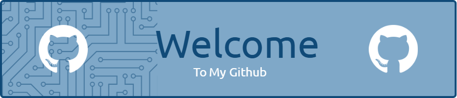

<!-- ## Hi there 👋 -->

<!--
**AQodS/AQodS** is a ✨ _special_ ✨ repository because its `README.md` (this file) appears on your GitHub profile.

Here are some ideas to get you started:

- 🔭 I’m currently working on ...
- 🌱 I’m currently learning ...
- 👯 I’m looking to collaborate on ...
- 🤔 I’m looking for help with ...
- 💬 Ask me about ...
- 📫 How to reach me: ...
- 😄 Pronouns: ...
- ⚡ Fun fact: ...
-->

<h1 align="left">Hi, I'm Qoddri👋</h1>

###

_<h5>What are you looking for?</h5>_

###

<h2 align="left">About me</h2>

###

I am a Physics graduate from Institut Teknologi Bandung, specializing in Computational Photonic Physics. With almost three years of experience as a physics teacher for High school and TPB (first year ITB students). I love helping others understand the wonder of physics. I am proficient in math and able to apply knowledge of physics to solve complex problems. I have also studied Web Programming, Data Science, and Machine Learning. Now, I am ready for a new adventure and excited to dive into the world of Information Technology  ✨ Creating bugs since 2023 🌱 I'm currently learning Backend Development 🎯 Goals: Physicist & Programmer 🎲 Fun fact: Rendang is so damn good

###

<h2 align="left">Tech Stack</h2>

###

  
  
  
  
  
  
  
  
  
  
  
  
  
  
  
  
  
  
  
  
  
  
  
  
  
  
  
  
  
  
  
  
  

###

<h2 align="left">Connect with me</h2>

###

  
  
  
  

###

<h5 align="left">Help me!  Pacman eat my commit.</h5>

###

<picture>
  <source media="(prefers-color-scheme: dark)" srcset="https://raw.githubusercontent.com/AQodS/AQodS/output/pacman-contribution-graph-dark.svg">
  <source media="(prefers-color-scheme: light)" srcset="https://raw.githubusercontent.com/AQodS/AQodS/output/pacman-contribution-graph.svg">
  
</picture>

###
